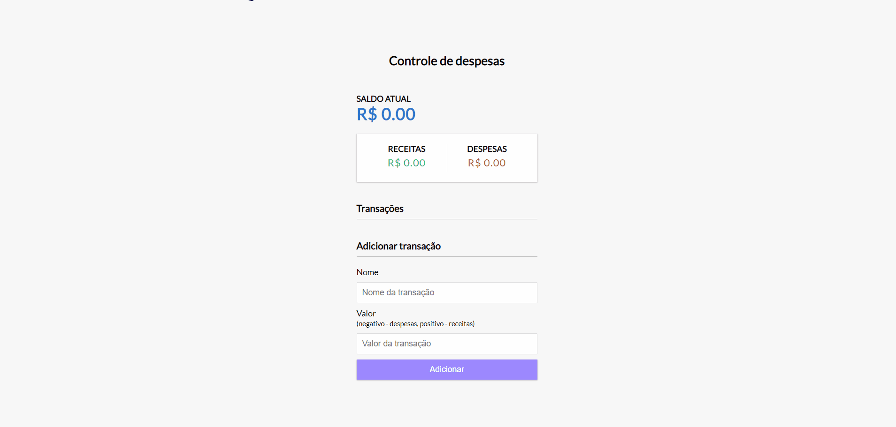
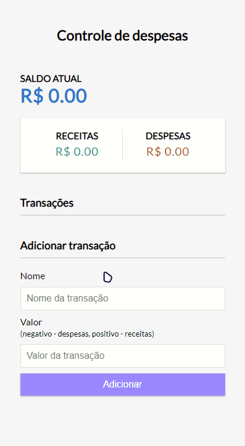

# Expense Tracker

<br />

## 💻 Sobre o projeto

Expense-tracker - é uma aplicação web de controle financeiro que auxilia o usuario a controlar seus gastos, permitindo que ele cria e exclua dados de seus gastos e os salve no Local Storage.

<br />

## 🔥 Resultado

<p align="center">
  

  
</p>

<br/>

## :rocket: Tecnologias
- [HTML5](https://developer.mozilla.org/en-US/docs/Glossary/HTML5)
- [CSS3](https://developer.mozilla.org/pt-BR/docs/Web/CSS)
- [Javascript](https://developer.mozilla.org/pt-BR/docs/Web/JavaScript)

<br />

## 🤔 Como testar

O site esta hospedado no vercel: [Controle Financeiro](https://expansetrackerlms.vercel.app)

Ou então, faça um clone :

```sh
  $ git clone https://github.com/lucasmsoares1/expense-tracker
```
